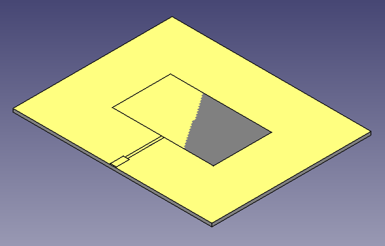
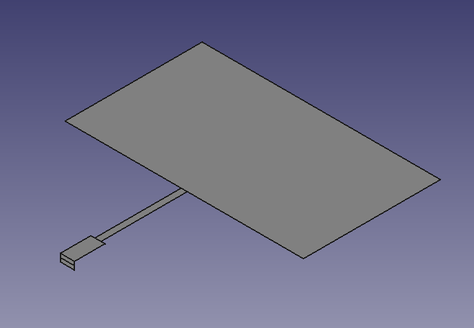

## igeswrite

Igeswrite is a Python 3 library for creating
IGES files.  IGES is a standard for exchanging solid models.
It was first published in 1980,
https://en.wikipedia.org/wiki/IGES.  Most RF simulation
software like FEKO, HFSS, and CTS support importing
IGES files.   



Since the DXF format unfortunately does not really support
solid models, it is not widely used for RF simulation.
DXF however can be imported into SONNET as a 2D model.

Igeswrite supports generating the following solid models: 1) lines,
2) xz planes, 3) yz planes, 4) xz planes, and 5) cubes.

The library class provides the following methods:

```
Iges.write(self, filename=None)
    - filename is the name of the file to write the model to.  If no 
      filename is given the model will be printed to standard output.
Iges.line(self, points, origin=(0,0,0))
    - points is given as a list [ax, ay, az, bx, by, bz]
Iges.xzplane(self, (w, h), origin=(0,0,0))
Iges.yzplane(self, (w, h), origin=(0,0,0))
Iges.plane(self, (w, h), origin=(0,0,0))
    - w, h is the width and height of the plane in 2D
Iges.cube(self, (w, l, h), origin=(0,0,0))
    - w, l, h is the width, length and height of the cube in 3D
```

See the files microstrip.py and patch.py for examples.
The following code will create a PCB board:


```
from igeswrite import Iges
bw = 100   # PCB board width in mm
bl = 80    # PCB board length in mm
h = 1.6    # PCB board thickness in mm

cx = bw / 2
cy = bl / 2

# board
iges = Iges()
iges.cube((bw, bl, -h), origin=(-cx, -cy, 0))
iges.write()
```


To add a patch antenna, with microstrip and connection 
to ground for the port, to the board use:

```
l = 29.2   # length of patch
w = 50.8   # width of patch
dw = 1.3   # width of quarter wave line
dl = 18    # length of quarter wave line
zw = 3.0   # width of 50 ohm line
de = 0.5   # offset from edge
ext = h * .44 * (1 - dw / zw) 

# patch antenna
iges = Iges()
iges.plane((w, l), origin=(-w/2, -l/2, 0))

# transmission line
d0 = l/2 + dl + ext
d1 = cy - de
iges.plane((dw, dl + ext), origin=(-dw/2, -d0, 0))
iges.plane((zw, d1 - d0), origin=(-zw/2, -d1, 0))

# edge port
iges.xzplane((zw, -h/2), origin=(-zw/2, -d1, 0))
iges.xzplane((zw, -h/2), origin=(-zw/2, -d1, -h/2))
iges.write()
```



## boardsvg

The boardsvg library generates svg files for say an vinyl cutter.
For example  generates the following svg file:


After unioning all rectangles in this file in inkscape to remove the line crossings,
I got the following result for vinyl cutting.  (You can use stroke to path
to remove the fill and see the cutting pattern.)


